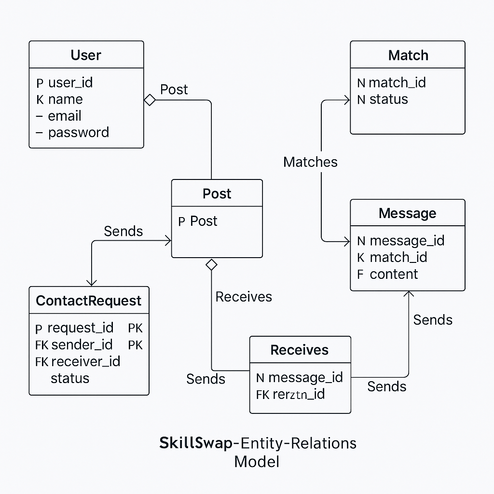
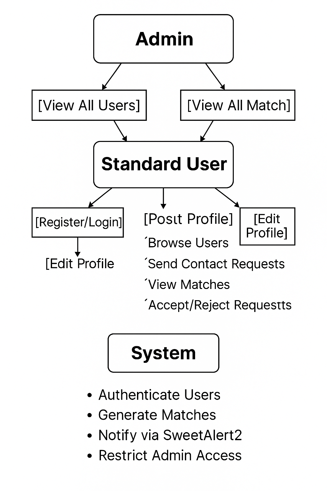

# SkillSwap – Skill Exchange Platform   

This project is a web application for connecting people who want to share and learn skills. SkillSwap allows users to register, create a profile, and publish what they can teach and what they want to learn. Through a friendly and dynamic interface, users can find matches and exchange knowledge.

## Project Description

SkillSwap was created to foster collaborative learning. It works like a social learning network, where each user can be a teacher and a learner. The app supports skill posting, smart matching, and contact requests, all in a secure and structured environment.

## User Roles

**Standard User:**

* Can register and log in
* Can publish skills to teach and learn
* Can send and receive contact requests
* Can view matches and accept/reject

**Administrator:**

* Can access user and match listings
* Can view all records
* Has full access

## Table of Contents

* Project Description
* Technologies Used
* Functional Requirements
* Non-Functional Requirements
* Use Cases
* Mockup
* Entity-Relationship Model (ER)
* UML Diagrams
* Folder Structure
* Installation and Deployment
* Author

## Technologies Used

* PHP (backend development)
* MySQL (database management)
* HTML + Bootstrap 5 (frontend interface)
* SweetAlert (interactive alerts)
* Composer (dependency management)
* PHPMailer (email sending)
* MVC (Model-View-Controller)
* InfinityFree + FileZilla (free deployment)
* Postman (REST API testing)
* JWT (for REST API authentication) *future implementation*

## Functional Requirements

1. **User registration**
   Users can register as learners, instructors, or both.

2. **User login**
   Registered users can log in with their email and password.

3. **Profile management**
   Users can edit their name, email, profile photo, and personal description.

4. **Skill management (CRUD)**
   Users can create, view, update, and delete their skills (to teach or to learn). Each skill includes:

   * Name
   * Description
   * Level (Basic, Intermediate, Advanced)
   * Type (teach or learn)
   * Category
   * Creation date

5. **View user profiles**
   All registered users can view profiles and skills of other users.

6. **Send contact requests**
   Users can send a contact request to others based on skill compatibility.

7. **Match creation and status**
   When two users have compatible teach/learn skills, a match is created.
   Matches can be in one of the following states: `pending`, `accepted`, or `rejected`.

8. **Match management**
   Users can view their own matches and update the match status.
   Admins can view all matches.

9. **Admin panel**
   Admin users have access to full user and match listings.

10. **Interactive alerts**
    SweetAlert2 is used for user-friendly success and error messages.

11. **Security and permissions**
    Only logged-in users can manage profiles, skills, and matches.
    Only admins can access global user and match lists.

## Non-Functional Requirements

1. **Responsiveness**
   The platform must be responsive and usable on mobile, tablet, and desktop devices.

2. **Usability**
   The interface should be intuitive and easy to navigate for users.

3. **Security**

   * Passwords are hashed using a secure algorithm.
   * Only authorized users can perform certain actions.

4. **Performance**
   The app must respond quickly (under 2 seconds for key actions).

5. **Maintainability**
   The system uses a clean MVC structure and separation of logic, views, and data.

6. **Scalability**
   The app is designed to support an increasing number of users, skills, and matches.

7. **Accessibility**
   Colors and layout were chosen to ensure good contrast and legibility.

8. **Internationalization**
   The system is structured to be easily translatable to other languages in the future.

## Use Cases

1. **User Registration**
   The user accesses the registration form and provides their name, email, password, and role.

2. **User Login**
   A registered user logs into the system with email and password.

3. **View and Edit Profile**
   The user can view and update their personal information, upload a photo, and describe their background.

4. **Add Skills**
   Users can register skills they can teach or want to learn, specifying the name, description, level, type, and category.

5. **Browse Other Users**
   Users can browse profiles of other users to see their skills and background.

6. **Send Contact Request**
   A user can send a contact request to another user whose skills match their learning interest.

7. **Accept or Reject Match**
   Users can view and manage their match requests, accepting or rejecting them.

8. **Manage Skills**
   A logged-in user can edit or delete their skills from the system.

9. **Admin Features**
   Admin users can view all users and matches.

## Mockup

## Entity-Relationship Model (ER)

Database: `skillswap`
Tables:

* `users` (id, name, email, password, role, reset\_token, token\_expiry)
* `skills` (id, user\_id, name, description)
* `matches` (id, user1\_id, user2\_id, skill\_id, status)

## UML Diagrams

## Folder Structure

APP\_SKILLSWAP/
│
├── api/                  → REST API handlers
├── app/                  → Core application logic (controllers/models)
├── config/               → Database and app configuration files
├── public/               → Entry point (index.php)
├── src/Services/         → Helper services (e.g., MailService)
├── vendor/               → Composer dependencies
├── phpmailer/            → External mailer library
│   └── autoload.php
├── views/                → HTML views organized by feature
│   ├── admin/            → Admin dashboard
│   ├── auth/             → Auth views (login, register, etc.)
│   ├── contact/          → Contact request pages
│   ├── home/             → Homepage
│   ├── matches/          → Match management
│   ├── shared/           → Header, footer, messages
│   ├── skills/           → Skill CRUD views
│   └── users/            → User profiles and admin views
├── composer.json         → Composer configuration
├── composer.lock         → Composer lock file
└── README.md             → Project documentation

## Installation and Deployment

To deploy the project using InfinityFree:

1. **Create an account at [InfinityFree](https://infinityfree.net)**
2. **Create a new hosting site and note your FTP credentials**
3. **Download and install [FileZilla](https://filezilla-project.org/)**
4. **Connect to your InfinityFree FTP using FileZilla**
5. **Upload the contents of your project folder (especially /public, /app, /views, /config, etc.)**
6. **Import your MySQL database to the InfinityFree database server via phpMyAdmin**
7. **Update the database connection file (`config/database.php`) with your InfinityFree credentials**
8. **Make sure your home route starts at `/public/index.php` or is routed properly**

## Author
admin vic@gmail.com 
password 5678V
https://github.com/EvaVic19/SkillSwap
Eva Victoria Sánchez – Backend development, frontend design, and deployment

   

